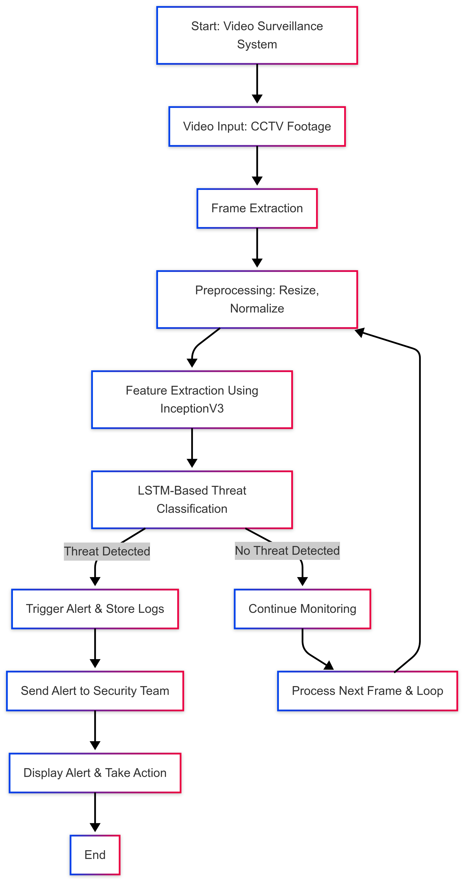

# **Autonomous Threat Detection in Video Surveillance**

## **Overview**
This project aims to develop an AI-driven surveillance system that utilizes deep learning for real-time threat detection in crowded areas. The system will identify potential threats such as weapons, violent activities, and suspicious behavior, enhancing public safety and security.

1. [Problem Statement](#problem-statement) 
2. [Features](#features)
3. [Dataset](#dataset)
4. [Installation](#installation)
5. [Project Workflow](#project-workflow)
6. [Model Architecture](#model-architecture)
7. [Model Performance](#model-performance)
8. [Model Deployment](#model-deployment)
9. [Meeting Evaluating Criteria](#meeting-evaluating-criteria)
10. [Meet the Team](#meet-the-team)

## **Problem Statement**
Create an AI-driven surveillance system that uses deep learning for real-time threat detection, including weapons, violence, and suspicious activities in crowded areas. 

## **Features**
- **Real-time threat detection**: Detects weapons, fights, and other suspicious activities.
- **Deep learning-based analysis**: Utilizes CNNs, RNNs, or transformer-based models.
- **Crowded scene monitoring**: Optimized for high-density public areas.
- **Automated alerts**: Sends real-time notifications to security personnel.
- **Scalability**: Works across multiple surveillance cameras.

## **Technologies Used**
- **Programming Languages**: Python
- **Deep Learning Frameworks**: TensorFlow / PyTorch
- **Computer Vision**: OpenCV, YOLO 
- **Video Processing**: OpenCV
- **Cloud & Edge Deployment**: AWS

## **Dataset**
- Open-source datasets like UCF-Crime Dataset, or custom-annotated video footage.
- References: https://github.com/ayush9304/Criminal-Activity-Video-Surveillance-using-Deep-Learning/tree/main/Data
- Data augmentation and preprocessing for better model performance.


## 📦**Installation**
1. Clone the repository:
   ```bash
   git clone https://github.com/your-repo/autonomous-threat-detection.git
   cd autonomous-threat-detection
2. Install dependencies:
   ```bash
   pip install -r requirements.txt
3. Download and prepare the dataset.


## 📊 Project Workflow 


## 🏗 **Model Architecture**
**1. Feature Extraction Model**
- Uses InceptionV3 (pre-trained on ImageNet).
- Extracts 2048-dimensional feature vectors from video frames
```python
def build_feature_extractor
input_shape=(224, 299, 3):
    feature_extractor = tf.keras.applications.InceptionV3(
        weights="imagenet",
        include_top=False,
        pooling="avg",
        input_shape=input_shape,
    )
    preprocess_input = tf.keras.applications.inception_v3.preprocess_input

    inputs = tf.keras.Input(input_shape)
    preprocessed = preprocess_input(inputs)

    outputs = feature_extractor(preprocessed)
    return tf.keras.Model(inputs, outputs, name="feature_extractor")
```

**2. Sequence Classification Model**
- Uses LSTM layers to process sequential features.
- Includes Dropout (0.4) and Dense layers for final classification.
- Trained on crime video datasets.
```python
def get_sequence_model():
    class_vocab = label_processor.get_vocabulary()

    frame_features_input = tf.keras.Input((MAX_SEQ_LENGTH, NUM_FEATURES))
    
    x = tf.keras.layers.LSTM(256, return_sequences=True)(frame_features_input)
    x = tf.keras.layers.LSTM(128)(x)
    x = tf.keras.layers.Dropout(0.4)(x)
    x = tf.keras.layers.Dense(32, activation="relu")(x)
    output = tf.keras.layers.Dense(len(class_vocab), activation="softmax")(x)

    rnn_model = tf.keras.Model(frame_features_input, output)

    rnn_model.compile(
        loss="categorical_crossentropy", optimizer="adam", metrics=["accuracy"]
    )
    return rnn_model
```

## 📊 **Model Performance**
| Model                           | Purpose                                      | Architecture                                      | Accuracy                |
|--------------------------------|----------------------------------------------|--------------------------------------------------|------------------------|
| InceptionV3 Feature Extractor | Extracts spatial features from video frames | Pre-trained InceptionV3                         | Used for feature extraction |
| LSTM-based Sequence Model     | Classifies crime activities from extracted features | LSTM (256 → 128), Dense, Softmax | 87.7% |
---

## 🏆**Meeting Evaluation Criteria**
### **1. Innovation** 
- **Creativity:** Uses deep learning models to detect weapons, violence, and unusual activities.  
- **Uniqueness:** Advanced AI-driven threat detection with real-time alerts, unlike traditional surveillance.  

### **2. Scalability**  
- **Architecture:** Optimized AI models for cloud-based and edge-device deployment.  
- **Load Balancing:** Efficient processing of multiple CCTV feeds in real time.  

### **3. Technical Implementation**  
- **Development:** Robust AI pipeline with dataset preprocessing, training, and deployment.  
- **Efficiency:** Optimized real-time processing with minimal latency and false alarms.  

### **4. Presentation**  
- **Clarity:** Well-documented project with structured code and deployment guides.  
- **Effectiveness:** Demonstrates real-world application through case studies or simulations.  

### **5. Impact**  
- **Relevance:** Addresses critical security concerns in public spaces.  
- **Potential:** Can be integrated with law enforcement and smart city initiatives.  

---
## **Meet The Team**
1. **Aryan Paratakke**:

   - **GitHub**: [Aryan Paratakke GitHub](https://github.com/Aryan152005/)
   - **LinkedIn**: [Aryan Paratakke LinkedIn](https://in.linkedin.com/in/aryan-paratakke-43b879276)

2. **Arya Hotey**:

   - **GitHub**: [Arya Hotey GitHub](https://github.com/Arya202004)
   - **LinkedIn**: [Arya Hotey LinkedIn](https://in.linkedin.com/in/arya-hotey-aab5b32a7)

3. **Nishtha Kashyap**:
   - **GitHub**: [Nishtha Kashyap GitHub](https://github.com/nishtha932005)
   - **LinkedIn**: [Nishtha Kashyap LinkedIn](https://in.linkedin.com/in/nishtha-kashyap-0b6846293)
